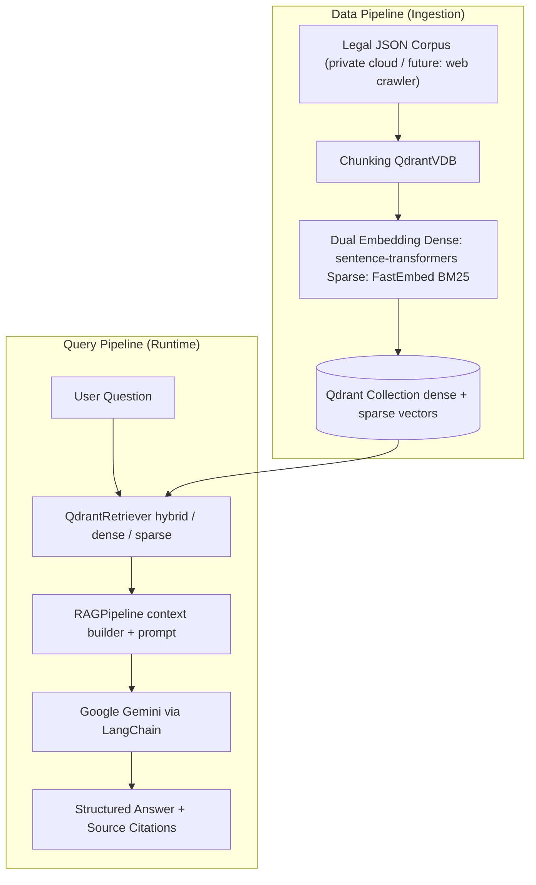

<div align="center">

# ⚖️ Vietnamese Legal RAG System

**Retrieval-Augmented Generation for Vietnamese Law Q&A**

[](https://www.python.org/)
[](https://qdrant.tech/)
[](https://ai.google.dev/)
[](https://python.langchain.com/)
[](https://streamlit.io/)
[](LICENSE)

A production-ready RAG pipeline that answers questions about Vietnamese legislation. It retrieves relevant legal articles from a Qdrant vector database using **hybrid search** (dense + sparse BM25), then synthesizes a structured, citation-backed answer via **Google Gemini**.

</div>

---

## Key Features

- **Hybrid Search** — combines dense semantic embeddings with sparse BM25 (FastEmbed) via Qdrant's built-in fusion for higher recall
- **Structured Citations** — every answer references the exact law ID and article number (`law_id`, `aaid`)
- **Three Retrieval Modes** — switch between `dense`, `sparse`, and `hybrid` at runtime
- **LangChain LCEL Chain** — composable, streaming-friendly pipeline (`Runnable` primitives)
- **Streamlit Chat UI** — streaming word-by-word output, sidebar configuration, collapsible source expander
- **Extensible Data Pipeline** — clearly separated ingestion layer, ready for a web-crawling stage to be plugged in

---

## Architecture



> **Data Pipeline note:** The corpus is currently sourced from a private cloud storage. The ingestion layer (`src/indexing/qdrantvdb.py`) is designed to accept any JSON corpus, making it straightforward to add a web-crawling stage later without modifying the downstream pipeline.

---

## Tech Stack

| Layer             | Technology                   | Role                              |
| ----------------- | ---------------------------- | --------------------------------- |
| **LLM**           | Google Gemini (`gemini-*`)   | Answer synthesis                  |
| **Orchestration** | LangChain LCEL               | RAG chain composition             |
| **Vector DB**     | Qdrant                       | Hybrid vector storage & retrieval |
| **Dense Embed**   | `sentence-transformers`      | Semantic Vietnamese embeddings    |
| **Sparse Embed**  | `fastembed` (BM25)           | Keyword-based retrieval           |
| **UI**            | Streamlit                    | Chat interface with streaming     |
| **Config**        | `pydantic-settings` + `.env` | Typed environment configuration   |
| **Runtime**       | Python 3.13+, `uv`           | Package & environment management  |

---

## Project Structure

```text
.
├── config/
│   └── config.py               # Typed settings (Pydantic BaseSettings)
├── src/
│   ├── indexing/
│   │   └── qdrantvdb.py        # Corpus ingestion: chunk → embed → upsert
│   ├── embedding/
│   │   └── embedd_model.py      # VietnameseLegalEmbedding wrapper
│   ├── vectorstores/
│   │   └── qdrant_store.py     # QdrantRetriever (dense / sparse / hybrid)
│   ├── retrieve/
│   │   └── retrieve_rerank.py  # High-level Retriever wrapper
│   ├── generation/
│   │   └── rag.py              # RAGPipeline (LCEL chain + Gemini)
│   └── eval/
│       └── eval_retrieve.py    # Retrieval evaluation utilities
├── main.py                     # CLI entry point
├── streamlit_app.py            # Web chat interface
├── pyproject.toml              # Dependencies (uv / pip)
└── .env.example                # Environment variable template
```

---

## Quick Start

### Prerequisites

- Python ≥ 3.13
- Docker (for local Qdrant)
- A [Google AI Studio](https://aistudio.google.com/) API key

### 1 — Clone & install

```bash
git clone https://github.com/PandaNguyen/RAG_LAW_VN.git
cd RAG_LAW_VN

# Recommended: uv
uv sync

# Alternative: pip
python -m venv .venv && .venv\Scripts\activate
pip install -e .
```

### 2 — Configure environment

```bash
copy .env.example .env   # Windows
# cp .env.example .env   # macOS/Linux
```

Edit `.env` with your values (see [Configuration](#configuration) below).

### 3 — Start Qdrant & run

```bash
# Start Qdrant locally
docker run -p 6333:6333 qdrant/qdrant

# (First time) Index your legal corpus
#   → uncomment OPTION 1 in main.py, set file_data_path, then:
python main.py

# Launch the chat UI
streamlit run streamlit_app.py
```

---

## Configuration

All settings are loaded from `.env` via `pydantic-settings`.

| Variable                      | Description                            | Example                       |
| ----------------------------- | -------------------------------------- | ----------------------------- |
| `QDRANT_URL`                  | Qdrant server URL                      | `http://localhost:6333`       |
| `QDRANT_API_KEY`              | Qdrant API key (leave blank for local) | `your-qdrant-cloud-key`       |
| `QDRANT_COLLECTION_NAME`      | Target collection name                 | `legal_documents`             |
| `GOOGLE_API_KEY`              | Google Gemini API key                  | `AIza...`                     |
| `EMBEDDING_MODEL_NAME`        | Dense embedding model                  | `keepitreal/vietnamese-sbert` |
| `SPARSE_EMBEDDING_MODEL_NAME` | Sparse (BM25) model                    | `Qdrant/bm25`                 |
| `EMBEDDING_SIZE`              | Dense vector dimension                 | `768`                         |
| `LLM_MODEL`                   | Gemini model name                      | `gemini-2.0-flash`            |
| `LLM_TEMPERATURE`             | Generation temperature                 | `0.1`                         |
| `DEFAULT_TOP_K`               | Default number of retrieved documents  | `5`                           |

---

## Usage

### Streamlit Chat UI

```bash
streamlit run streamlit_app.py
```

The sidebar lets you configure:

- **Qdrant collection name** — switch between different legal corpora
- **Retrieval mode** — `hybrid` (default), `dense`, or `sparse`
- **Top K** — number of source documents to retrieve (1–20)

Each answer includes an expandable **"Nguồn tham khảo"** (References) section with the cited law ID and article number.

### CLI

```bash
python main.py
```

Uncomment **OPTION 2** in `main.py` to run a sample query directly through `RAGPipeline`.

---

## Roadmap

- [ ] **Web Crawler integration** — automated ingestion from official Vietnamese legal portals (e.g., thuvienphapluat.vn) into the data pipeline
- [ ] **Reranking** — cross-encoder reranker fine-tuned on Vietnamese legal text
- [ ] **FastAPI backend** — decouple the retrieval/generation backend from the Streamlit UI
- [ ] **Evaluation suite** — RAGAS-based faithfulness & answer relevance metrics
- [ ] **Multi-collection routing** — query-time routing across specialized collections (civil law, criminal law, labor law)
- [ ] **UTF-8 normalization** — consistent encoding across all prompt/display text

---

## License

This project is licensed under the **MIT License** — see the [LICENSE](LICENSE) file for details.
